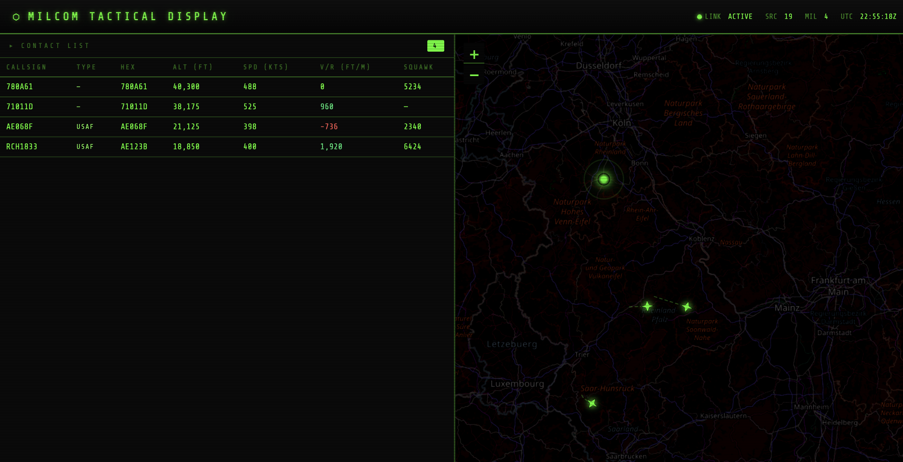

# MilCom - Military Aircraft Monitor

MilCom is a lightweight, web-based dashboard designed to monitor military aircraft traffic in real-time. It fetches ADS-B data from a local receiver and applies specialized filters to highlight military assets.



## Filtering & Identification

MilCom uses a multi-layered filter with **OR logic** – any single match is enough to display an aircraft.

### 1. Aircraft Database Lookup (Primary Filter)
On startup, MilCom automatically downloads the [`tar1090-db`](https://github.com/wiedehopf/tar1090-db) aircraft database (`aircraft.csv.gz`, ~8 MB) directly from GitHub. This database is maintained by the readsb/Mictronics project and contains ICAO hex codes with a `dbFlags` field:

| Bit | Meaning |
|-----|---------|
| `& 1` | **Military** ← used as primary filter |
| `& 2` | Interesting |
| `& 8` | LADD (Law Enforcement / sensitive) |

The database is refreshed automatically every **12 hours** at runtime. No manual download required.

### 2. ICAO HEX Range Filter (Safety Net)
Even if the database misses an aircraft (e.g., newly registered airframe, download not yet complete), MilCom catches it via known **military-only ICAO hex blocks**:

| Range | Country |
|-------|---------|
| `AE0000–AFFFFF` | USA |
| `43C000–43CFFF` | GBR |
| `3E8000–3E8FFF`, `3FC800–3FCFFF` | DEU |
| `3A0000–3A0FFF` | FRA |
| `478100–4781FF` | NATO |
| `4B8000–4BFFFF` | TUR |
| `4A0000–4AFFFF` | GRC |
| … and more | |

### 3. Emergency Exception
Any aircraft broadcasting **Squawk 7700** (General Emergency) is **always** displayed regardless of type.

### Type Identification
Aircraft type is resolved in this order:
1. **CSV database** type code (e.g. `C17`, `EUFI`, `A400`)
2. **Live `t` field** from the readsb JSON (when DB-enriched)
3. Fallback: `MILITARY`

## Admin Endpoints

| Endpoint | Description |
|----------|-------------|
| `GET /db-status` | Shows DB load time, military ICAO count, last error |
| `POST /db-reload` | Triggers immediate DB re-download |
| `GET /db-debug` | Returns first 10 raw CSV rows (for format verification) |

## Hardware Requirements

*   **Raspberry Pi** (or similar SBC) with ADS-B receiver (e.g. FlightAware Pro Stick, RTL-SDR)
*   **Antenna** tuned for 1090 MHz
*   **Software**: readsb / tar1090 (`/airplanes/data/aircraft.json` endpoint)

## Features

*   **Real-time Map** with history trails (last 20 GPS positions)
*   **Distance-sorted contact list** – nearest aircraft at top
*   **REG + TYPE columns** from live data and aircraft DB
*   **Tactical HUD**: pulsing ⊕ crosshair icon for military contacts, national flag emojis, ▲/▼ altitude trend arrows
*   **Click-to-pan**: click a row to fly the map to that aircraft and highlight its trail
*   **Sonar ping** audio alert on new contact detection
*   **Basic Auth** protected access

## Installation via Docker Compose

1.  **Clone the repository**:
    ```bash
    git clone https://github.com/krisauseu/milcom.git
    cd milcom
    ```

2.  **Configure** `docker-compose.yml`:
    ```yaml
    environment:
      - PI_IP=192.168.1.100   # IP of your readsb/tar1090 receiver
      - AUTH_USER=admin
      - AUTH_PASS=yourpassword
    ```

3.  **Start**:
    ```bash
    docker-compose up -d
    ```
    The aircraft database downloads automatically on first start (~5 seconds).

4.  **Access**: `http://<your-server-ip>:5050`

## License

For educational and hobbyist use. Data accuracy depends on local receiver coverage and the aircraft database.
